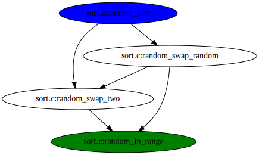

# gcc-callgraph-plugin

A python script to print call graphs during compilation with GCC. It uses the
[gcc-python-plugin](https://github.com/davidmalcolm/gcc-python-plugin)
architecture.

Example output for [`examples/random-sort`](examples/random-sort):



## Features

- Display the whole callgraph, considering all compilling files.
- Performs in O(V + E), where V is the number of functions and E is the number
  of calls.
- Possibility to restrict callgraph with sets of starting and ending functions.
- Possibility to exclude certain functions.
- Accept any output format known by `dot`.
- Differentiate two or more valid functions with the same name.

## Dependencies 

- python version >= 3.5
- [PyYAML](https://pyyaml.org/)
- [gcc-python-plugin](https://github.com/davidmalcolm/gcc-python-plugin)
- dot (from the [graphviz](https://www.graphviz.org/) package)

## Using

With the `gcc-python-plugin` installed, compile your code with:

```
    $ gcc -fplugin=python \
	  -fplugin-arg-python-script=<path to gcc-callgraph-plugin.py> \
	  -flto -flto-partition=none \
	  <other args>
```

This will generate a `callgraph.svg` image in the working directory, containing
the program's call graph.

Note:
- Give the full path to `-fplugin-arg-python-script`. Don't use `~/`, for
  example.
- When compiling and linking in two steps, don't forget to use those flags in
  both of them.
- If you are compilling a code with a Makefile, you can use `make CC="gcc
  -fplugin ..."`

### With docker

You may also skip installing dependencies and run the plugin in a docker
container.

To build the image:

```
    $ docker build -t callgraph .
```

Then, in the directory of the project you want to generate the call graph for,
run:

```
    $ docker run -v "$PWD:/src" -it callgraph
```

This will run the container interactively, giving you a bash session in the
directory it was invoked. Then you can compile your project with the same
command shown in the previous section. Just remember to use:

```
-fplugin-arg-python-script=/plugin/gcc-callgraph-plugin.py
```

## Configuring output

The plugin will read user specified settings from a `.gcc-callgraph.yml` file,
in the working directory or in the user's home directory (in this order). This
file must be in YAML format and can contain the following attributes:

- `start` (str or str list): set of functions to start the callgraph at. Any
  call chain that  doesn't start in one of these is excluded.
- `end` (str or str list): set of functions to end the callgraph at. Any call
  chain that does not end in one of these is excluded.
- `exclude` (str or str list): set of functions to be excluded from the
  callgraph.
- `multiple_edges` (boolean): whether to display each call between functions A
  and B as individual edges or as a single edge (default is False).
- `abort_on_func_not_found` (boolean): whether to abort imediatelly if any
  function specified in the config file is not found (True), or continue with a
  warning (False). (default is False)
- `out_file` (str): output file name. Extension must be one of the formats
  accepted by `dot`, e.g. `.png` or `.svg` (default is `callgraph.svg`).

**Functions must be specified in the format** `path:function_name`, where
`path` points to the file in which the function was declared, relative to the
working directory of compilation. When specified, the starting nodes will be
colored blue and the end ones green.

As an example, with the following we get all paths from a function A to a
function B that don't contain a function C (all declared in the same file,
main.c):

```
start: main.c:A
end: main.c:B
exclude: main.c:C
```

## Examples

The `examples` directory contain a couple of toy C projects to compile with this
plugin. Every subdirectory has a `M̀akefile` designed to generate the call graph
inside the `callgraph` docker container.

## Extra

If you want to find paths in the call graph for a particular execution, you
might want to try [callpath](https://github.com/matheustavares/callpath).

